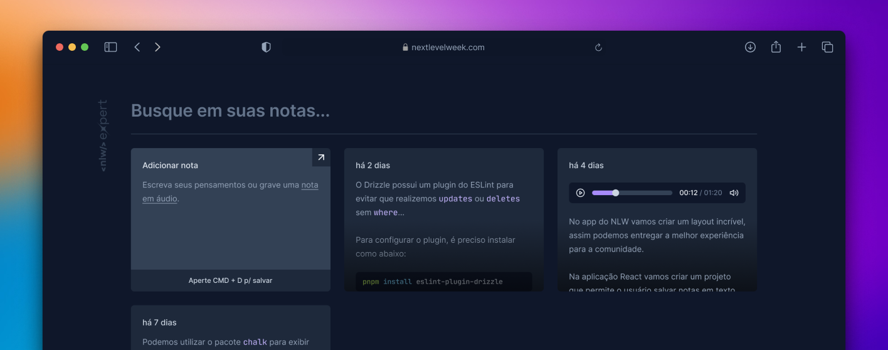

# NLW Expert (React)

Notes application with audio recording converted to text, developed during Rocketseat's NLW Experts using React, TypeScript, Tailwind and the SpeechRecognition API.

## Executando

After cloning the repository, access the project folder and execute the commands below:

```js
npm install
npm run dev
```

- Access [http://localhost:5173](http://localhost:5173) to view the application.

##

<p align="center">
   
</p>
